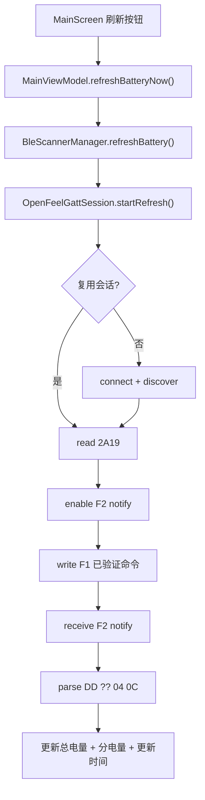

# 架构说明

本文档描述当前版本的稳定模块边界与数据流，目标是便于维护，不追求过度抽象。

## 模块职责

### 1) UI（Compose）

- `MainScreen`：只负责展示与用户交互。
- `MainViewModel`：只编排 UI 状态、触发刷新、导出日志。

### 2) 设备匹配 / 刷新入口

- `BleScannerManager`：
  - 提供刷新入口 `refreshBattery()`。
  - 维护权限/蓝牙可用性检查。
  - 当前刷新主链路不依赖后台扫描结果。

### 3) GATT 会话协调

- `OpenFeelGattSession`：
  - 连接/复用连接
  - discover services
  - 读取 `2A19`
  - 启用 F2 notify
  - 发送 F1 已验证命令
  - 接收 F2 回包
  - 触发解析与状态更新

### 4) 协议解析

- `OpenFeelBatteryParser`：
  - 标准电量解析（2A19）
  - 分电量帧识别与解析（04 0C）

### 5) 日志与导出

- `InMemoryLogStore`：内存日志缓冲。
- `DownloadLogExporter`：导出日志到 Download（MediaStore）。

## 刷新链路（行为简图）

## 当前不做的事

- 不把未验证协议语义写死到正式 UI。
- 不自动发送未知命令。
- 不扩展到通用多设备平台（当前阶段）。

## 维护建议

- 任何涉及 BLE 时序改动，先做日志基线对比。
- 保持“行为不变优先”的渐进式重构节奏。
